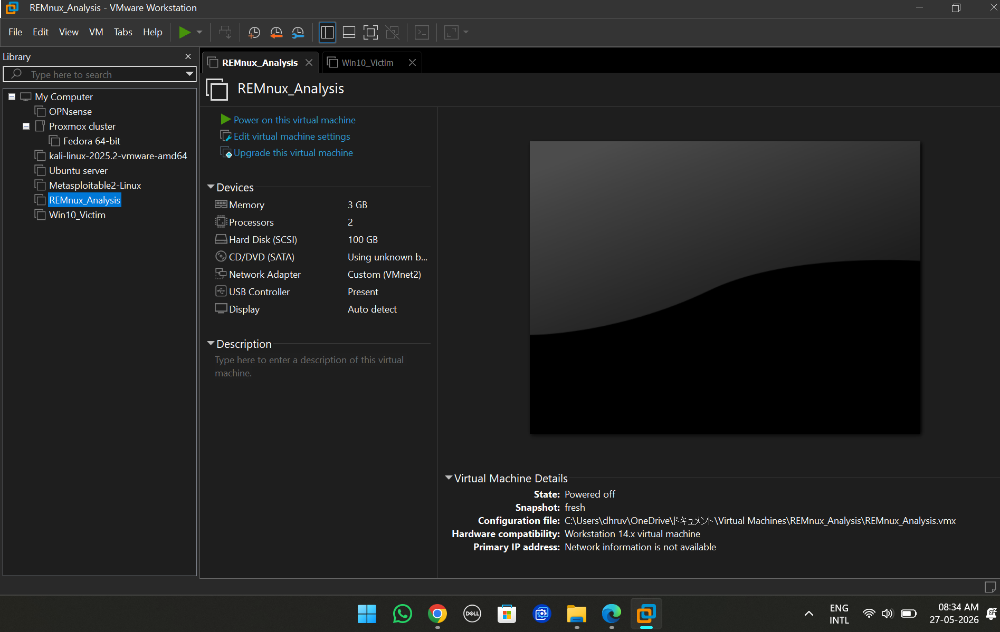
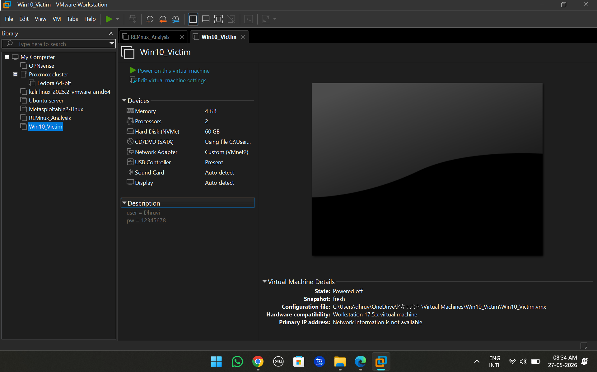
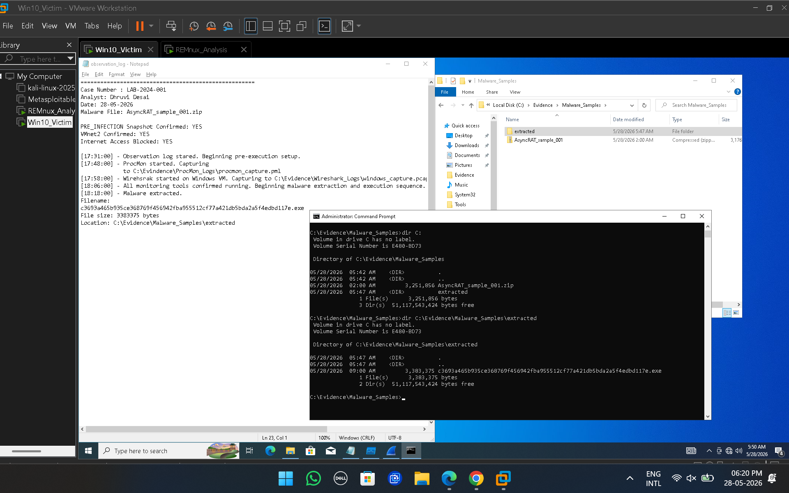
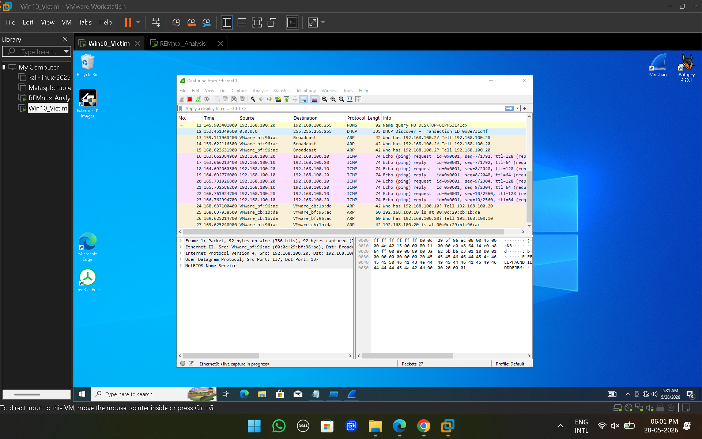
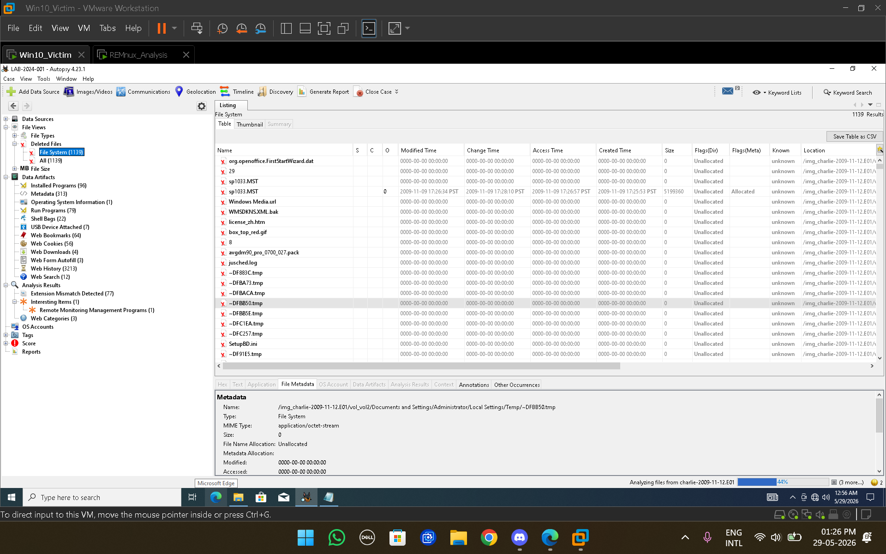
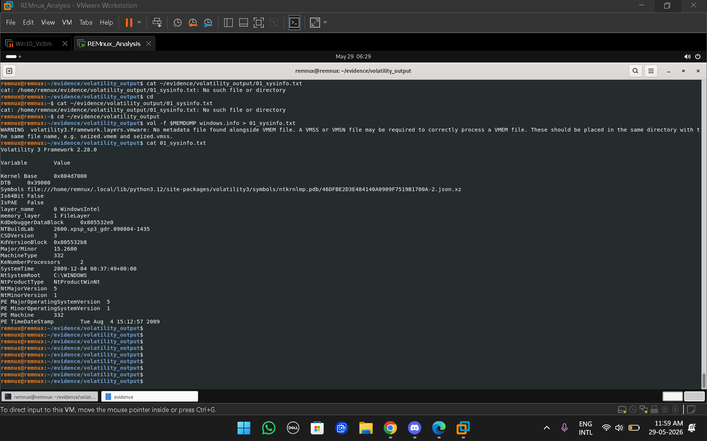
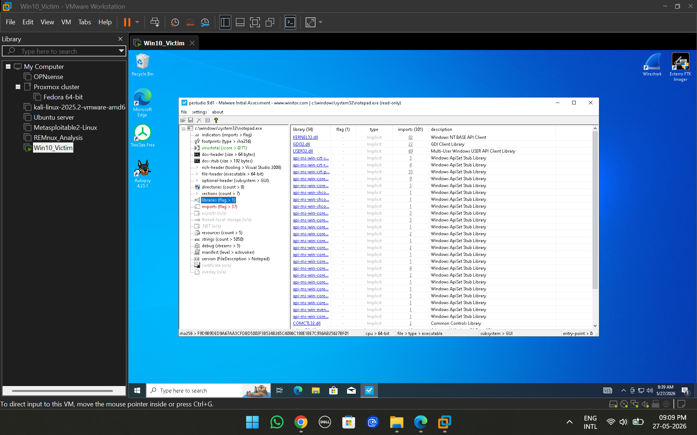

# 🔍 Windows XP DFIR Investigation — Case LAB-2024-001

> **Digital Forensics and Incident Response (DFIR) Portfolio Project**  
> Analyst: Dhruvi Desai | Case: LAB-2024-001 | Classification: Educational / Unclassified

---

## 📋 Project Summary

This project documents a complete end-to-end Digital Forensics and Incident Response (DFIR) investigation conducted on a publicly available Windows XP forensic dataset from [Digital Corpora](https://digitalcorpora.org/). The investigation follows professional forensic methodology across memory, disk, network, and static analysis phases — culminating in IOC extraction, MITRE ATT&CK mapping, YARA rule development, and a formal investigation report.

The project was conducted in a purpose-built virtual laboratory environment using industry-standard DFIR tools. Where hardware limitations or evidence constraints required scope adaptations, these are explicitly documented in accordance with evidence-based forensic reporting principles.

> ⚠️ **Scope Note:** This is an educational DFIR project using publicly available forensic datasets. No real-world systems were accessed. All adaptations made due to hardware or tool limitations are documented transparently throughout.

---

## 🎯 Objectives

- Build and configure a functional, isolated DFIR laboratory environment
- Analyze volatile memory artifacts from a Windows XP system using Volatility 3
- Investigate disk artifacts for persistence mechanisms, user activity, and deleted content using Autopsy
- Review network packet captures for suspicious communications using Wireshark
- Perform static executable analysis using PE Studio
- Develop a custom YARA detection rule
- Extract and document Indicators of Compromise (IOCs)
- Map evidence-supported findings to the MITRE ATT&CK framework
- Produce a professional-grade forensic investigation report

---

## 🔄 Scope Adaptations

The original project design included malware extraction and analysis from forensic artifacts recovered during the investigation.

During analysis, no confirmed malware sample was identified within the available evidence. Additionally, hardware limitations and virtual machine performance constraints restricted the feasibility of extended dynamic malware analysis.

To demonstrate the complete DFIR workflow while maintaining forensic accuracy, the static analysis and YARA development phases were adapted using a legitimate executable (`Wireshark.exe`). This allowed the methodology, tooling, hash verification, PE analysis, and YARA rule development processes to be demonstrated without fabricating findings or misrepresenting evidence.

All adaptations made during the investigation have been documented transparently and are reflected throughout the project report and supporting documentation.

---

## 🏗️ Lab Architecture

```text
   ┌─────────────────────────────────────────────────────────────┐
   │                VMware Host-Only Network                     │
   │                       VMnet2                                │
   └─────────────────────────────────────────────────────────────┘

        ┌─────────────────────┐      ┌─────────────────────┐
        │     REMnux VM       │      │   Windows 10 VM     │
        │   (Analysis Host)   │◄────►│   (Victim System)   │
        ├─────────────────────┤      ├─────────────────────┤
        │ IP: Isolated Lab    │      │ IP: Isolated Lab    │
        │                     │      │                     │
        │ Tools:              │      │ Tools:              │
        │ • Volatility 3      │      │ • Procmon           │
        │ • Wireshark         │      │ • Wireshark         │
        │ • YARA              │      │ • Autoruns          │
        │ • Strings           │      │ • Process Explorer  │
        │ • PEStudio          │      │ • FTK Imager        │
        │ • CyberChef         │      │ • Autopsy           │
        └─────────────────────┘      └─────────────────────┘

                🔒 FULLY ISOLATED DFIR LAB

                 No production network exposure
                Safe malware analysis environment
                Snapshot-based forensic workflow

```

### Environment Configuration

| Component | Configuration |
|------------|--------------|
| Hypervisor | VMware Workstation |
| Analysis VM | REMnux Linux |
| Victim VM | Windows 10 |
| Network Type | Host-Only (VMnet2) |
| REMnux RAM | 3 GB |
| REMnux Disk | 100 GB |
| Windows RAM | 4 GB |
| Windows Disk | 60 GB |
| Isolation Level | Fully Isolated |
| Purpose | DFIR & Malware Analysis |

---

## 🧰 Tools Used

| Tool | Purpose | Phase |
|---|---|---|
| VMware Workstation | Virtual lab environment | Lab Setup |
| REMnux | Linux forensic analysis workstation | Lab Setup |
| Volatility 3 | Memory forensics framework | Memory Forensics |
| Autopsy | Disk forensic analysis platform | Disk Forensics |
| Wireshark | Network packet analysis | Network Forensics |
| PE Studio | Static PE executable analysis | Static Analysis |
| YARA | Signature-based detection rule engine | Detection Engineering |
| Certutil | Hash generation and verification | Evidence Integrity |
| FTK Imager | Evidence acquisition reference tool | Evidence Preparation |
| Velociraptor | Endpoint forensics (installation verified) | Endpoint Forensics |

---

## 📸 Investigation Highlights

| Phase | Screenshot | Description |
|---------|---------|-------------|
| 🖥️ Lab Setup |  | REMnux forensic workstation configured with isolated VMnet2 networking for secure malware analysis and evidence processing. |
| 🖥️ Lab Setup |  | Windows 10 victim machine prepared to simulate user activity and generate forensic artifacts for investigation. |
| ⚠️ Malware Preparation |  | Suspicious AsyncRAT sample extracted in a controlled environment while maintaining an observation log and preserving forensic integrity. |
| 🌐 Network Analysis |  | Network monitoring verified using Wireshark to capture traffic generated during malware execution and user activity simulation. |
| 💾 Disk Forensics |  | Deleted files and system artifacts recovered using Autopsy to identify user actions and reconstruct system activity. |
| 🧠 Memory Forensics |  | Volatility 3 used to identify the Windows memory profile and prepare the memory image for forensic analysis. |
| 🔬 Static Analysis |  | PE Studio used to inspect executable imports, libraries, and indicators without executing the sample. |

> 📁 Additional screenshots, command outputs, and detailed phase-by-phase analysis are available in the [screenshots](screenshots/) directory.

---

## 🔬 Investigation Methodology

This investigation followed an industry-standard DFIR workflow:

```
Evidence Acquisition → Integrity Verification → Memory Analysis
→ Disk Analysis → Network Analysis → Static Analysis
→ Detection Engineering → IOC Extraction → ATT&CK Mapping → Reporting
```

See [methodology.md](methodology.md) for detailed phase-by-phase documentation.

---

## ✅ Phases Completed

| Phase | Activity | Status |
|---|---|---|
| 1 | Laboratory Environment Setup | ✅ Complete |
| 2 | Evidence Acquisition & Preparation | ✅ Complete |
| 3 | Memory Forensics (Volatility 3) | ✅ Complete |
| 4 | Disk Forensics (Autopsy) | ✅ Complete |
| 5 | Network Forensics (Wireshark) | ✅ Complete |
| 6 | Static Analysis (PE Studio) | ✅ Complete — adapted scope |
| 7 | YARA Rule Development | ✅ Complete |
| 8 | IOC Extraction | ✅ Complete |
| 9 | MITRE ATT&CK Mapping | ✅ Complete |
| 10 | Forensic Report Production | ✅ Complete |

---

## 🔑 Key Findings

### Memory Forensics (Volatility 3)
- **System Identified:** Windows XP SP3, 32-bit, memory captured 2009-12-04 UTC
- **Active Processes:** `firefox.exe` (PID 2684), `thunderbird.exe` (PID 764), `cmd.exe` (PID 3124), `mdd_1.3.exe` (PID 3336)
- **Hidden Processes:** None detected — pslist/psscan comparison revealed no DKOM-style manipulation
- **Malfind:** PAGE_EXECUTE_READWRITE regions identified in multiple processes; no embedded MZ/PE headers confirmed — findings inconclusive given Windows XP + AV environment
- **DLL Analysis:** No suspicious DLL loading from temp or non-standard directories
- **Registry Hives:** SYSTEM, SOFTWARE, SAM, SECURITY, DEFAULT, NTUSER.DAT all identified

### Disk Forensics (Autopsy)
- **Installed Applications:** Firefox, Thunderbird, OpenOffice, AVG Antivirus, Adobe Reader, Java Runtime Environment
- **Web Downloads:** Python installer, Thunderbird installer, OpenOffice installer artifacts recovered
- **Remote Monitoring Artifacts:** Atera-related entries identified in Autopsy Interesting Items — documented, not confirmed malicious
- **Extension Mismatches:** Configuration files, recovery data, application databases — no disguised malware confirmed
- **USB Devices:** Mouse and keyboard only — no USB storage devices identified
- **Deleted Files:** 1,000+ deleted file entries reviewed; temporary files, application artifacts, installer data — no malware payloads recovered

### Network Forensics (Wireshark)
- **DNS Traffic:** Queries to Microsoft services, `lafontainebleu.org`, connectivity test domains
- **HTTP Traffic:** GET and POST requests observed; three POST requests to `72.5.43.29` — insufficient evidence to classify as malicious
- **No C2 Identified:** No beaconing patterns, DGA behavior, or confirmed command-and-control communications

### Static Analysis (PE Studio)
> *Scope Adaptation: No confirmed malware sample recovered. Wireshark.exe analyzed to demonstrate static analysis workflow.*
- **Target:** Wireshark.exe v4.6.8 — 64-bit PE, 18.6 MB
- **SHA-256:** `99DC13045CC75BA9FEAEB8E9C56A1BE0E2C22DEAC15B474A435469B33E6D76B1`
- **MD5:** `5DD9D2DB30F70063BFCAB99450417CE4`
- **Entropy:** 7.327 — consistent with legitimate packed/compressed software
- **Finding:** No malicious indicators — file consistent with legitimate software

### Final Assessment
> No definitive indicators of active malware infection or system compromise were identified within the investigation scope. Evidence artifacts were consistent with normal workstation activity. The investigation successfully demonstrated a complete professional DFIR workflow.

---

## 📌 Indicators of Compromise (IOCs)

| Type | Value | Context |
|---|---|---|
| SHA-256 | `99DC13045CC75BA9FEAEB8E9C56A1BE0E2C22DEAC15B474A435469B33E6D76B1` | Wireshark.exe — analyzed executable |
| MD5 | `5DD9D2DB30F70063BFCAB99450417CE4` | Wireshark.exe — analyzed executable |
| IP | `10.8.15.133` | Host system — network capture |
| IP | `72.5.43.29` | Destination of outbound HTTP POST requests |
| IP | `23.205.110.48` | HTTP connectivity test destination |
| Domain | `lafontainebleu.org` | DNS queries — Wireshark analysis |
| Domain | `www.python.org` | Download artifact — Autopsy |
| Process | `mdd_1.3.exe` (PID 3336) | Memory acquisition utility |

See [ioc_worksheet.md](ioc_worksheet.md) for the complete IOC documentation.

---

## 🗺️ MITRE ATT&CK Techniques

| Technique ID | Name | Evidence |
|---|---|---|
| T1071.001 | Application Layer Protocol: Web Protocols | HTTP GET/POST traffic in Wireshark |
| T1071.004 | Application Layer Protocol: DNS | DNS queries including `lafontainebleu.org` |
| T1204.002 | User Execution | Web download artifacts in Autopsy |
| T1027 | Obfuscated Files or Information | Entropy 7.327 on analyzed executable |

See [mitre_mapping.md](mitre_mapping.md) for complete mapping with evidence citations.

---

## 🛡️ YARA Rule

A custom YARA detection rule (`LAB001_Malware_Detection`) was developed to demonstrate signature-based detection engineering. The rule identifies PE executables containing strings recovered during static analysis.

See [yara-rule.md](yara-rule.md) for the complete rule and documentation.

---

## 💡 Skills Demonstrated

### 🔧 Technical Skills

| Domain                      | Skills Applied                                                                                                   |
| --------------------------- | ---------------------------------------------------------------------------------------------------------------- |
| **Digital Forensics**       | Evidence acquisition, forensic imaging, chain-of-custody documentation, hash verification, evidence preservation |
| **Memory Forensics**        | Volatility 3, process enumeration, DLL analysis, registry hive identification, malicious process hunting         |
| **Disk Forensics**          | Autopsy, file system analysis, deleted file recovery, web history investigation, USB device artifact analysis    |
| **Network Analysis**        | Wireshark, DNS traffic analysis, HTTP session investigation, conversation analysis, IOC extraction               |
| **Static Malware Analysis** | PE Studio, hash generation (MD5/SHA256), PE structure analysis, entropy review, import analysis                  |
| **Detection Engineering**   | YARA rule creation, signature development, malware identification techniques                                     |
| **Threat Intelligence**     | IOC collection, IOC validation, ATT&CK technique mapping, indicator documentation                                |
| **Virtualization**          | VMware Workstation, snapshot management, isolated analysis environments, host-only networking                    |

---

### 🔍 Investigation Methodology Skills

| Area                     | Skills Applied                                                                                  |
| ------------------------ | ----------------------------------------------------------------------------------------------- |
| **Evidence Handling**    | Maintaining forensic integrity, preserving original evidence, documenting investigative actions |
| **Artifact Correlation** | Correlating memory, disk, network, and endpoint artifacts to reconstruct activity               |
| **Timeline Analysis**    | Identifying user actions and system events through forensic artifacts                           |
| **IOC Development**      | Extracting, validating, documenting, and organizing indicators of compromise                    |
| **Threat Hunting**       | Investigating suspicious processes, network activity, and persistence mechanisms                |
| **Analytical Thinking**  | Formulating hypotheses, validating findings, and eliminating false positives                    |
| **Documentation**        | Maintaining investigation logs, evidence records, and structured findings                       |

---

### 📊 Professional Competencies

| Competency                     | Demonstrated Through                                                                        |
| ------------------------------ | ------------------------------------------------------------------------------------------- |
| **Problem Solving**            | Troubleshooting forensic tools, VM configuration issues, and evidence collection challenges |
| **Attention to Detail**        | Artifact verification, hash validation, and evidence accuracy checks                        |
| **Research Skills**            | Investigating malware behavior, forensic techniques, and detection methodologies            |
| **Technical Reporting**        | Writing investigation reports, documenting findings, and presenting conclusions             |
| **Cybersecurity Operations**   | Applying DFIR workflows aligned with industry practices                                     |
| **Lab Management**             | Building and maintaining a secure malware analysis environment                              |
| **Documentation Standards**    | Organizing evidence, screenshots, logs, and investigative outputs                           |
| **Professional Communication** | Translating technical findings into understandable reports and project documentation        |

---

### 🛠️ Tools & Technologies

| Category                  | Tools Used               |
| ------------------------- | ------------------------ |
| **Memory Analysis**       | Volatility 3             |
| **Disk Analysis**         | Autopsy, FTK Imager      |
| **Network Analysis**      | Wireshark                |
| **Static Analysis**       | PE Studio, CertUtil      |
| **Detection Engineering** | YARA                     |
| **Virtualization**        | VMware Workstation       |
| **Operating Systems**     | REMnux Linux, Windows 10 |
| **Documentation**         | Markdown, GitHub         |

---

### 🎯 Key Learning Outcomes

* Built and operated a complete DFIR laboratory environment.
* Performed forensic investigations across memory, disk, network, and endpoint artifacts.
* Applied industry-standard forensic methodologies and evidence handling practices.
* Developed detection content using YARA signatures.
* Extracted and documented Indicators of Compromise (IOCs).
* Improved malware analysis and threat investigation capabilities.
* Produced professional investigation documentation suitable for portfolio and interview discussions.
* Gained practical experience with tools commonly used by DFIR analysts and SOC teams.

---

## 📚 Lessons Learned

- **Evidence over assumptions** — Artifacts initially appearing suspicious (malfind regions, POST requests) did not yield sufficient evidence for malicious classification
- **Cross-correlation is critical** — Memory, disk, and network artifacts must be analyzed together before drawing conclusions
- **False positives are common** — PAGE_EXECUTE_READWRITE memory regions and elevated entropy are not independently conclusive
- **Tool limitations are real** — Volatility 3's `netscan` plugin does not support Windows XP SP3; analysts must understand tool scope
- **Documentation matters** — Thorough screenshot capture and note-taking directly enabled professional report production
- **Adaptability is a professional skill** — Adjusting scope due to hardware constraints while maintaining forensic accuracy reflects real-world investigative practice

See [lessons-learned.md](lessons-learned.md) for the full reflection.

---

## 📁 Repository Structure

```
Digital Forensics Investigation Lab/
│
├── README.md                    ← You are here
├── project-notes.md          ← Background, goals, dataset, results
├── methodology.md               ← Phase-by-phase investigation workflow
├── lessons-learned.md           ← Technical and professional reflections
├── ioc_worksheet.md             ← All extracted Indicators of Compromise
├── mitre_mapping.md             ← ATT&CK technique mapping with evidence
├── yara-rule.md                 ← Custom detection rule and documentation
│
├── report/
│   └── LAB-2024-001_DFIR_Report.docx   ← Formal investigation report
│
├── evidence/
│   └── README.md                ← Evidence inventory and hash records
│
├── tools-used/
│   └── README.md                ← Tool versions and configuration notes
│
└── screenshots/
    ├── 01_lab-setup/            ← VMware, REMnux, Windows 10 configuration
    ├── 02_memory-forensics/     ← Volatility 3 analysis outputs
    ├── 03_disk-forensics/       ← Autopsy artifact findings
    ├── 04_network-analysis/     ← Wireshark traffic analysis
    ├── 05_static-analysis/      ← PE Studio, hash verification, YARA
    ├── 06_dynamic-analysis/     ← Process Monitor, observation logs
    ├── 07_endpoint-forensics/   ← Velociraptor installationz
    └── 08_sample-acquisition/   ← Sample metadata and hash records
```

---

## 🔮 Future Improvements

1. Upgrade to higher-performance analysis hardware to reduce VM performance constraints
2. Include timeline analysis using tools such as Plaso/log2timeline for event correlation
3. Integrate threat intelligence enrichment (VirusTotal, Shodan, AbuseIPDB) for IOC validation
4. Expand memory forensics with additional Volatility plugins (handles, svcscan, driverirp)
5. Complete full Autopsy artifact review pending 100% ingest completion
6. Repeat analysis against a dataset confirmed to contain active malware for full workflow exercise
7. Automate IOC extraction and reporting using Python scripting

---

## ⚖️ Disclaimer

This project was conducted for educational purposes using publicly available forensic datasets provided by [Digital Corpora](https://digitalcorpora.org/). No real-world systems, networks, or individuals were targeted. All findings and conclusions are confined to the educational investigation scope. This project does not constitute professional legal or forensic advice.

---

*Analyst: Dhruvi Desai | Case: LAB-2024-001 | Completed: May 2026*
